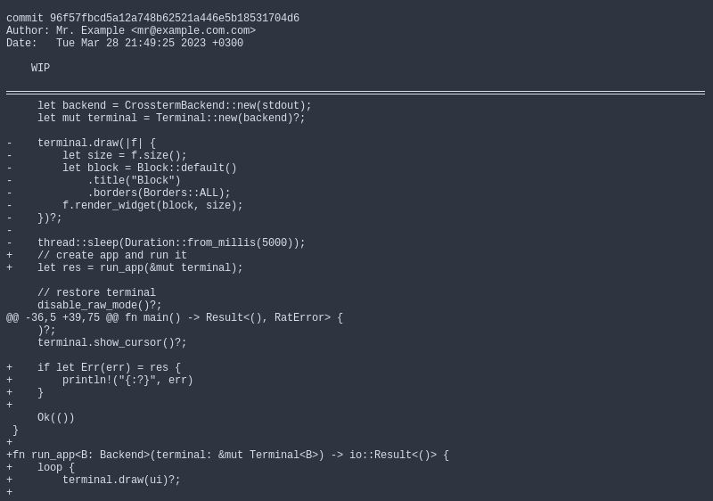

# Context aware pager

`cag` is a context aware pager displaying the currently viewed git commit's commit information when scrolling through the commit patch content.

Usage: `git diff --patch | cag`

